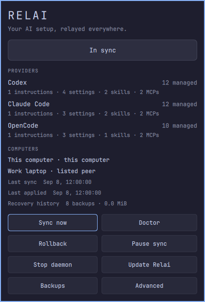
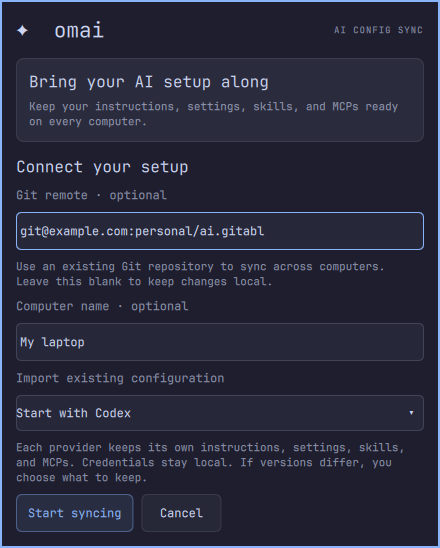

# omai UX review

Reviewed and revised the native Omarchy panel on September 8, 2026.

| Finding | Implemented behavior |
| --- | --- |
| Routine controls competed with maintenance commands | Compact status card, context-dependent primary action, pause/resume, and separate Sync details and Advanced disclosures |
| Healthy, offline, paused and stopped states did not explain what to do | Plain-language status, automatic retry expectations, relative timestamps, and an appropriate next action |
| Feedback appeared below the controls | Progress and errors appear directly below status; completed-action feedback clears after six seconds |
| Diagnostics, history and conflict review interrupted the flow with terminals | Read-only details load inside the panel, including empty, failed and loading states; only very long conflict previews offer an explicit full comparison in a terminal |
| Immediate rollback and conflict choices were easy to trigger unintentionally | A separate confirmation view explains the affected item and consequence; Cancel is selected first; Escape goes back |
| Setup exposed implementation details and delayed validation | Clear local-versus-remote choice, examples, optional computer label, sensible import default, inline validation, Enter submission, and draft preservation |
| Keyboard focus and asynchronous responses could become confusing | Arrow movement follows button geometry, Tab follows reading order, disabled buttons are skipped, focused items scroll into view, and rapid view switches discard the old response |
| Recovery size and coverage labels lacked context | Human-readable sizes, singular/plural counts, explanation of missing categories, and a distinction between local undo history and the configuration synchronized in Git |

The panel uses the current Omarchy theme and a shared button component with hover, pressed, disabled, focus, and primary/destructive states. Text wraps within the available panel width. Read-only preview text can be selected with the mouse. Setup fields have accessible names and panel shortcuts do not intercept typing.

## Validation

The native fixture suite covers 32 scenarios: onboarding and validation, setup failure/retry, updating, safe reset, healthy/local/offline/pending/paused/stopped/error states, corrupt status, conflicts and confirmation, rollback confirmation, diagnostics with successful and failing checks, populated and empty recovery history, Unicode and long previews, failed reads, rapid read navigation, expanded details, and keyboard control.

Tests use disposable homes and fixture executables. They do not start real sync operations or modify provider files. Fixture screenshots were reviewed for setup, healthy sync, conflicts and the inline detail views. The backend and existing sync settings are unchanged by this UI revision.

